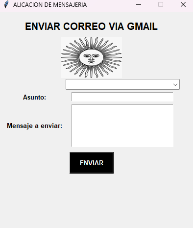

ENVIAR EMAIL 

En el presente proyecto se explora la interfaz para enviar emails, teniedo opcio de cargar mails para su posterior uso con un combobox 

PROCESOS DE MODIFICACIÓN 

-Se cambia la imagen predeterminada a una personalisada 

-importe la funcion ttk desde tkinter

-Luego del label de destinataio agregue un combobox de mails recientes con la función ttk

-En el combobox se modifico en tamaño de la interfaz, la funete, donde se guardarian los destinatarios en el menu de opciones 

IMAGEN DE LA INTERFAZ

CAPTURA DEL PROGRAMA 

